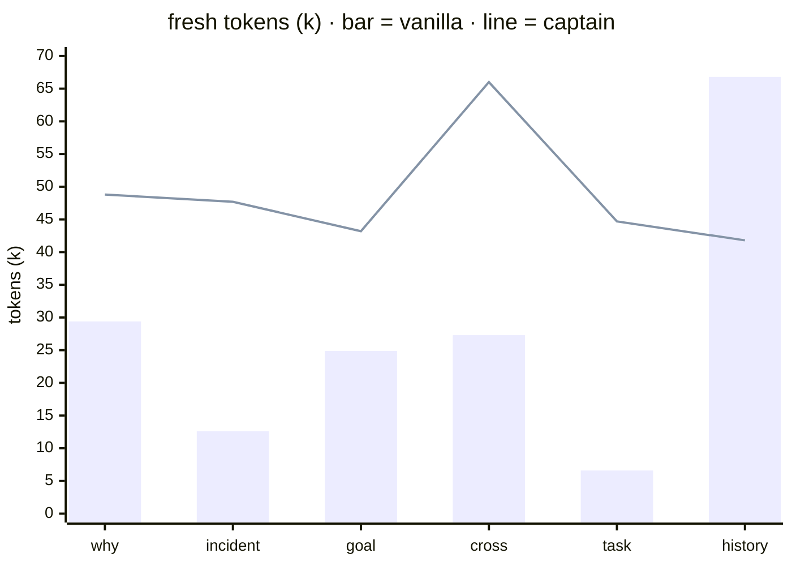
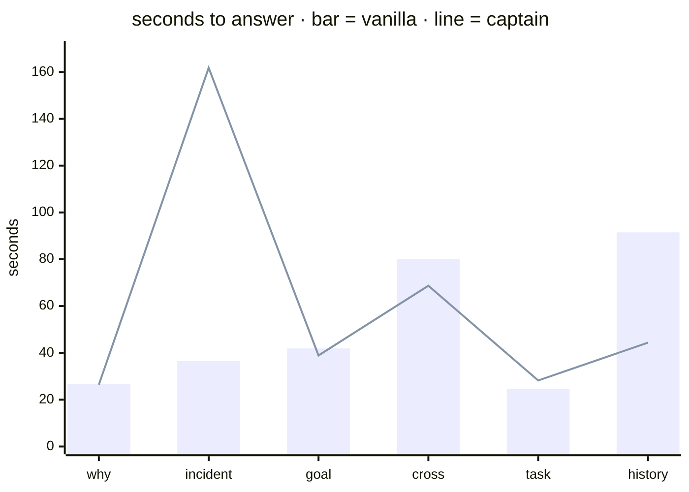
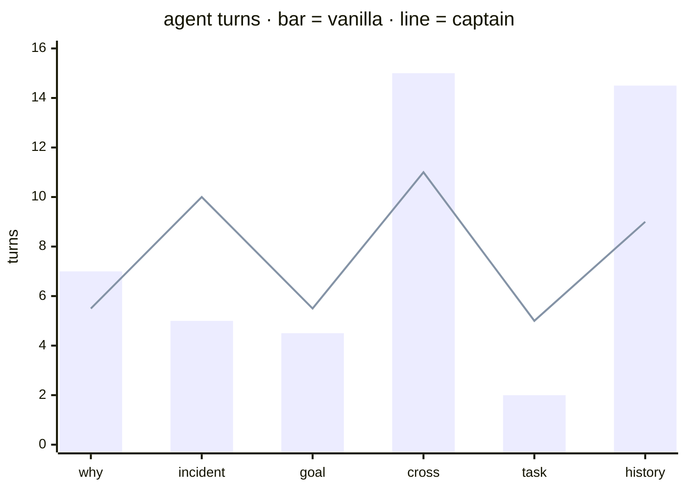

# Benchmark: captain vs no captain

Measure what a captain adds over a vanilla agent session on the same workspace.

## Summary

24 paired runs · production workspace · Claude Sonnet 5 · 2026-07-22.

| | vanilla | captain |
|---|---|---|
| correct | 33% | **83%** |
| wrong | 33% | **0%** |
| correct on org-memory-only questions | 0% | **100%** |
| citation validity | 63% | **93%** |
| answer quality (median, 1-5) | 3.5 | **4.0** |
| cost per correct answer | $1.67 | **$0.51** |
| cost, all runs | $6.66 | **$5.12** |
| wall-clock (median) | 40.1s | **38.9s** |
| agent turns (median) | 7.0 | **6.5** |

Where the answer lives decides who wins. When the fact is on disk (a postmortem, an architecture doc), both arms answer correctly and vanilla is cheaper. When the fact lives only in organizational memory (an accepted decision, a task's state, a goal conflict), vanilla scored **0%** and the captain **100%**. Averaged over a real mix of both, the captain is 2.5x more accurate, never wrong, and 3.3x cheaper per correct answer.

## Methodology

| Component | Based on |
|---|---|
| Paired A/B arms, identical fixture, same model and prompts | standard controlled paired-comparison design |
| Rubric grading by an LLM judge, blind to arm | LLM-as-judge: Zheng et al. 2023, [MT-Bench / Chatbot Arena](https://arxiv.org/abs/2306.05685) |
| Mechanical citation resolution (cites must exist and support the claim) | attribution evals: Gao et al. 2023, [ALCE](https://arxiv.org/abs/2305.14627) |
| Faithfulness and answer-relevance framing for graph-backed answers | RAG evaluation: [RAGAS](https://arxiv.org/abs/2309.15217) |
| Long-horizon memory question categories (why, what happened, status) | memory evals in the spirit of [LongMemEval](https://arxiv.org/abs/2410.10813) |
| Cost, token, turn, latency telemetry from the harness itself | agentic benchmark reporting practice (SWE-bench, τ-bench style) |

Results are paired: every question runs in both arms on the same fixture, and the per-question delta is the unit of evidence. Raw datapoints ship with every summary.

## Setup

Two arms. Same workspace, same model (Claude Sonnet 5, both arms and judge), same prompts, fresh isolated session per run.

| Arm | Session |
|---|---|
| A | vanilla Claude Code: no `.tsubasa/`, no captain `CLAUDE.md`; code, docs, and git history on disk |
| B | captain: knowledge graph + hot tier + persona, studied and linked |

Fixture: a production multi-repo platform workspace: 10+ repos, postmortems, ADRs, IaC, midway through a migration from a legacy engine to its replacement, with accepted decisions and active goals. The captain graph was built from those sources before the run.

## Question set

| Category | Question | Gold source |
|---|---|---|
| why | why does trip-gateway exist in the first place? | decision event + decommission goals |
| what happened | what caused the 2026-03-09 total dispatch outage, and what restored service? | P0 postmortem |
| what's next | any concerns before adding a multi-region routing feature to trip-gateway? | accepted migration ADR + goals |
| cross | how does the fare-fallback method verify fares, and where is it implemented? | feature entity + ADRs + code anchor |
| task | current status of the Rider-API v2 migration? | task thread + ADR-accepted event |
| history | did we ever attempt a production cutover to the new pricing engine? how did it go? | migration events |

## Metrics

| Metric | Measured how | Hypothesis |
|---|---|---|
| Token usage | fresh (input + cache-write + output) and total per answer, from session telemetry | A greps wide and reads files; B loads hot tier once, queries cold |
| Accuracy | graded vs gold: correct · partial · wrong · confabulated | A confabulates "why"; B cites or abstains |
| Citation validity | every cite mechanically resolved against graph and disk | B near 100%; A cites little or invents |
| Quality | 1-5 rubric: complete, concise, one-minute read | persona holds B terse |
| Speed | wall-clock + agent turns to final answer | B fewer turns: graph first, code second |
| Iteration | follow-up turns until correct; for impl tasks, review cycles until the change respects prior ADRs | B catches ADR conflicts before review |

## Results

### Paired grades, all runs

| Question | vanilla r1/r2 | captain r1/r2 |
|---|---|---|
| why | correct / correct | correct / correct |
| incident | correct / correct | correct / correct |
| goal conflict | wrong / wrong | **correct / correct** |
| cross (code + why) | partial / partial | correct / partial |
| task status | wrong / wrong | **correct / correct** |
| history | partial / partial | correct / partial |

Vanilla holds its own exactly where the answer is written down (why: an architecture doc; incident: the postmortem). It fails completely where the knowledge is organizational: the goal conflict and the task status, decided in conversation and recorded only in the graph.

### Fresh tokens per question (median, thousands)



### Wall-clock per question (median, seconds)



### Agent turns per question (median)



### Reading the medians

- **Fresh tokens**: the captain's higher median is a fixed load, not exploration: ~40k of hot tier + persona per fresh session. This benchmark charges it on every question; a real working session pays it once and caches it. Vanilla's cost instead scales with difficulty (6.6k on a shallow miss, 66.8k on a deep dig).
- **Vanilla is fast at being wrong**: its 2-turn, 24-second task-status answer scored wrong on both reps. Speed to a wrong answer is not a win. Per correct answer, the captain is 3.3x cheaper ($0.51 vs $1.67) and 1.4x more token-efficient (58k vs 84k fresh).
- On the hardest questions (cross, history) the captain is faster and takes fewer turns outright.

### Sample answers, measured

**Plan rejection (goal conflict)** — the user proposes next sprint's work; the captain rejects it, citing the conflict: *"We're planning to add a new multi-region routing feature to trip-gateway next sprint. Any concerns before we start?"*

```text
vanilla:  deep code trace of region routing internals, caching bugs,
          per-client routing selection. Solid engineering advice.
          Never surfaces the one fact that matters: trip-gateway
          is scheduled for decommission under an accepted migration ADR.
          grade: wrong · 41.9s · 24.9k fresh tokens

captain:  "Conflict — flag before scoping."
          1. The feature may already exist: multi-region routing
             shipped Nov 2025 (cited event). Clarify what is missing
             from that implementation before building anything.
          2. The gateway is mid-decommission, not mid-expansion:

             | goal              | relation to trip-gateway        |
             | goal-rider-api-v2 | retires svc-trip-gateway (cited)|
             | goal-direct-api   | apps bypass the gateway (cited) |

          Plan rejected as scoped. Either align the work with the
          migration, or change the record first; then it plans.
          grade: correct · 38.9s · 43.2k fresh tokens
```

**Task status** — *"What's the current status of the Rider-API v2 migration work?"*

```text
vanilla:  "Not started. SOW is drafted but unsigned; this is
          pre-contract, not in-flight engineering work."
          The decision it can't see: the migration ADR was accepted
          that same day and the wave-1 task opened. The doc on disk
          is one day behind the org.
          grade: wrong · 24.5s · 6.6k fresh tokens

captain:  "Status: ADR accepted, implementation not started." Table:
          ADR accepted 2026-05-14 (cited event), execution task todo,
          wave 1 scoped to the first client app, full scope: 4 client
          apps to the v2 API, native event schema, data backfill.
          grade: correct · 28.2s · 44.7k fresh tokens
```

**Incident** — *"What caused the total dispatch outage on 2026-03-09, and what restored service?"* (both arms correct; the answer is on disk)

```text
vanilla:  finds the postmortem, correct chain: /dev/shm 64 MiB tmpfs
          filled by orphaned Prometheus multiprocess .db files,
          SIGBUS cascade across every engine pod, restored by pod
          restart.
          grade: correct · 36.5s · but 2 of 6 extracted cites resolve

captain:  Root cause: unbounded /dev/shm growth from the metrics
          client's multiprocess mode. Worker recycling leaves orphaned
          histogram_*.db files; default /dev/shm is 64 MiB. Once full:
          mmap writes fail (OSError 28), SIGBUS cascade, master can't
          spawn workers, unrecoverable without pod restart.
            evt-…-p0-dispatch-outage-devshm: "detected via user
            reports, not alerting; restored by manual pod restart
            (fresh tmpfs)". Known upstream bug, closed wontfix
            (issue links cited).
            follow-up: task-shm-cleanup-sidecar [todo] + its ADR,
            so the fix state is part of the answer.
          8 of 9 cites resolve.
          grade: correct · the deepest answer of the run
```

### Verification notes

- Every wrong and confabulated verdict was human-reviewed; three judge grades were overridden after review (details traced to an on-disk ADR the judge lacked, one label inconsistent with its own rationale). Overrides are recorded in the raw data with rationale.
- Vanilla-arm runs contaminated by captain tooling installed globally on the test machine, or by auto-memory persisted from a prior run, were detected and rerun in a clean environment (plugin disabled, per-arm project memory cleared).
- The captain graph existed before the run; its one-time build cost is excluded.

## Protocol

1. Freeze the fixture and graph; write gold answers before any run.
2. Run every question in both arms, repeated, in fresh isolated sessions; report medians and all raw grades.
3. Grade with a blind LLM judge on the rubric; a human verifies every wrong and confabulated grade.
4. Resolve every citation mechanically: event ids against the graph, paths against disk.
5. Report per category and overall, USD next to tokens.

## Threats to validity

- Judge bias toward cited answers: citations are verified mechanically, not taken on faith.
- Fixture leakage: gold answers must not appear verbatim in any source doc arm A can read.
- The graph's build cost is real: a captain pays it once; vanilla pays exploration every session.

## Roadmap

Scale the question set, add ablation arms (hot tier only, graph query only), cross-family judge, and ship the harness as the v0.4 eval kit in [DESIGN.md](DESIGN.md).
