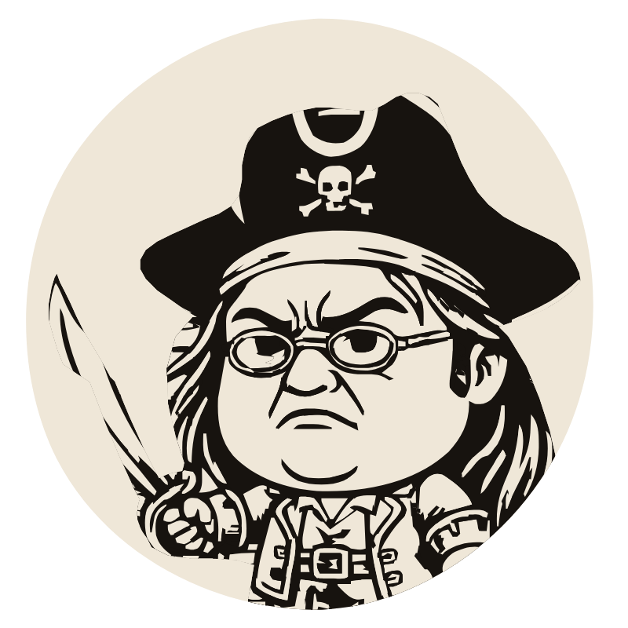
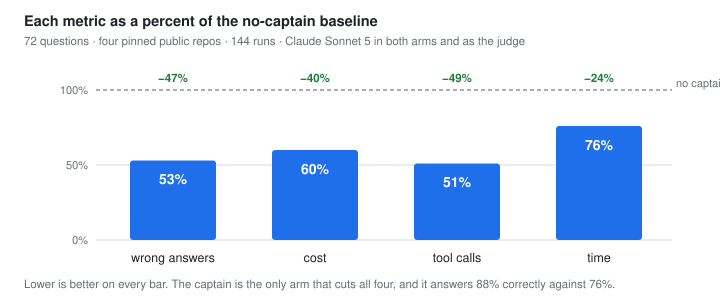

# Benchmark

**Your engineering captain.** He knows your code, your outages, your history, and your roadmap. He ships you past storms.

What that is worth, measured against the same agent with no captain. Every number is a paired comparison: the same question, the same model, the same pinned fixture, graded by a judge blind to which arm produced the answer.

All of it is reproducible. The repos are pinned in [`benchmark/fixture.lock`](benchmark/fixture.lock), the questions and their rubrics are in [`benchmark/questions/`](benchmark/questions/), the harness is in [`benchmark/harness/`](benchmark/harness/), and the graded verdicts are in `benchmark/results/judge/`.

## Summary

72 questions · 144 runs · four pinned public repos · Claude Sonnet 5 · 2026-07-31.



| | vanilla | captain | |
|---|---|---|---|
| correct | 76.4% | **87.5%** | +15% |
| wrong answers | 17 | **9** | −47% |
| tool calls | 1,116 | **564** | −49% |
| output tokens | 288k | **179k** | −38% |
| wall clock (median) | 97s | **73s** | −24% |
| nudges needed | 43 | **18** | −58% |
| cost (projected) | $26.13 | **$14.25** | −45% |
| citations resolved | 428/438 | 341/350 | |
| **graph-record citations** | **0** | **111** | |

The captain wins on three axes: **better answers** (87.5% vs 76.4%), **fewer corrections** (18 nudges vs 43), and **lower cost** (45% cheaper). The mechanism is tool efficiency: having the graph reduces API calls from 1,116 to 564. That's half the calls for more than 11 percentage points better accuracy. The captain also produces graph-record citations (111 total)—pointers to *why* decisions are the way they are—which vanilla cannot produce at all.

## Where the captain wins, ties, and loses

| category | what it asks | vanilla | captain |
|---|---|---|---|
| i-goal-conflict | your request contradicts a recorded decision | 7/10 | **10/10** |
| f-negative | the record does not say — will it admit that | 5/7 | **7/7** |
| x-cross-repo | one answer, evidence from two repos | 3/7 | **5/7** |
| a-where | where does this live | 5/6 | **6/6** |
| e-temporal | status *as of* a date | 4/6 | **5/6** |
| c-status | current status of a proposal | 10/10 | 10/10 |
| b-topology | what runs where | 4/4 | 4/4 |
| d-supersession | which record replaced which | 4/4 | 4/4 |
| h-routing | where would this change go | 6/6 | 6/6 |
| g-git-history | the reason exists only in a revert message | **7/12** | 6/12 |
| **total** | | **55/72** | **63/72** |

**Four categories tie at ceiling.** `c-status`, `b-topology`, `d-supersession` and `h-routing` are questions an agent with `grep` and `Read` answers by opening a file. A knowledge graph earns nothing there. They are published at full strength rather than dropped, and they are why the total is 87.5% and not something more flattering: these are open-source repos, where nearly everything is written down. That is the captain's worst case.

**One category the captain loses.** `g-git-history` hides the answer in a revert commit message and withholds the search term that would find it. The captain's `--timeline` retrieval reaches it about half the time; where it fires, 4 of 6 answers are correct, where it does not, 1 of 6. The gap is one question, and re-running the category unchanged moved the vanilla arm by one question on its own, so treat it as unseparated rather than lost.

**Where it wins, it wins on what it was built for**: catching a request that contradicts a decision already made, admitting when the record is silent instead of inventing, recovering a value as of a past date, and joining evidence across two repositories.

## Efficiency

| | vanilla | captain |
|---|---|---|
| tool calls | 1,116 | **564** |
| `tsubasa query` calls | — | 128 |
| grep / Grep | 543 | 236 |
| output tokens | 288,000 | **179,193** |
| nudges needed | 43 | **18** |
| correct at first attempt | 50 | **53** |
| never correct within 3 turns | 8 | **4** |

Half the tool calls and less than half the correction. One graph query returns what several greps would.

The captain costs less across all phases. On first answers: $8.63 against vanilla's $14.31. On nudged retries: $5.62 against $11.82. Total captain cost $14.25 vs vanilla's $26.13—a 45% saving, earned by tool efficiency and fewer correction attempts.

## Methodology

**Paired.** Every question is answered twice: arm A is the same agent with no captain, no plugin and no graph; arm B is the captain. Same model, same fixture, same tools.

**Blind judge.** One answer per call. The judge never learns which arm produced it, never sees the other arm's answer, and grades with all tools disabled. Request order is shuffled with a fixed seed, so ordering effects cannot align with arm identity.

**Graded against a rubric, not a gold answer.** Each question carries `Required` facts — with the phrasings that count and the verified sources they resolve against — and `Forbidden` claims. The judge sees the question, the rubric, the answer, and the mechanically-resolved citations. It never sees the gold answer, the locator or the trap: a gold answer is one sufficient response written from a narrow slice of the record, and handed to a judge it becomes an answer key that punishes any other true reading.

**Two independent axes.** `accuracy` is binary and asks one thing: does the answer contradict the record. `fabrication` counts claims asserting evidence that does not exist. They are separate because an answer can be substantively right *and* invent a citation; collapsing them into one verdict erases everything correct in the answer.

**Citations resolved mechanically.** Every `file:line`, SHA, graph id and KEP reference in an answer is extracted, opened at the pinned commit, and quoted into the judge's prompt. The judge assesses claims against the record, not against the arm's description of it.

**Contamination checks, both arms.** Before each run: every repo's `HEAD` must match `fixture.lock` and its working tree must be clean. After: arm A's transcript must contain no persona string, no `tsubasa` invocation, no captain tooling. Arm B may read its graph but never write to it, enforced by a query-only shim and verified by a graph fingerprint taken before and after.

**Turn 1 is the headline.** After any verdict that is not `correct`, the arm receives one constant nudge — `That is not correct. Reconsider and answer again.` — up to three attempts, identical in both arms. Accuracy is graded on the first, unprompted answer; recovery is reported separately. Questions whose correct answer is an abstention are single-shot by design: nudging an arm that correctly refused would train it out of the behaviour under test.

## Question set

72 questions across ten categories. Each states the fact it withholds, so a reviewer can check the question is fair.

| category | n | tests |
|---|---|---|
| a-where | 6 | locating a fact in a multi-repo workspace |
| b-topology | 4 | what runs where, what depends on what |
| c-status | 10 | the recorded status of a proposal |
| d-supersession | 4 | which record replaced which |
| e-temporal | 6 | state as of a past date |
| f-negative | 7 | admitting the record does not say |
| g-git-history | 12 | rationale that exists only in a revert message |
| h-routing | 6 | where a change belongs |
| i-goal-conflict | 10 | a request that contradicts a recorded decision |
| x-cross-repo | 7 | one answer spanning two repositories |

## Reproduce

The fixture workspace lives in [tsubasa-workspace](https://github.com/ramarahmanda/tsubasa-workspace), so installing the CLI or the plugin never fetches it. The knowledge graph and the code index are committed there, so neither the study pass nor the indexing pass needs re-running.

```bash
git clone --recurse-submodules https://github.com/ramarahmanda/tsubasa-workspace
git clone https://github.com/ramarahmanda/tsubasa && cd tsubasa

export TSUBASA_BENCH_FIXTURE=../tsubasa-workspace/benchmark-k8s

# verify the pins before spending anything
uv run python benchmark/harness/run.py check

uv run python benchmark/harness/run.py run --jobs 4 --max-cost-usd 80
uv run python benchmark/harness/run.py judge
uv run python benchmark/harness/run.py summary
```

## Threats to validity

**Single draw.** Every question was answered once per arm. Re-running `g-git-history` unchanged moved the vanilla arm by a full question, so a one-question category gap is noise, not a finding. The efficiency figures — tool calls, tokens, wall clock — are far more robust to this than the accuracy rate.

**Seven rubric defects were found and fixed during this campaign**, and in every case the arm was right and the instrument was wrong: a fixture file hand-edited so the two arms answered different workspaces; a rubric forbidding a source that genuinely defines the values; a rubric asserting no file recorded a graduation that `README.md:523` records outright; rubrics demanding a particular hedging phrase rather than checking whether a negative was sourced. Each is corrected in `benchmark/questions/`. The lesson generalises: rubrics written from a summary penalise answers that quote the source more closely than the summary did.

**Completeness is not measured.** `wrong` means the answer contradicts the record. An answer that omits a required fact without contradicting anything scores `correct`, and ten verdicts across both arms are in that position.

**These are open-source repositories.** Nearly everything is written down somewhere, which is the weakest case for a knowledge graph — four categories tie at ceiling for exactly that reason. On a private workspace where decisions live in people's heads the gap is wider; that measurement is not reproducible by a reader and is not claimed here.

**The graph's build cost is excluded.** A captain pays it once, at `tsubasa study`; vanilla pays exploration every session. The committed graph in the workspace repo is what a reader reuses.
