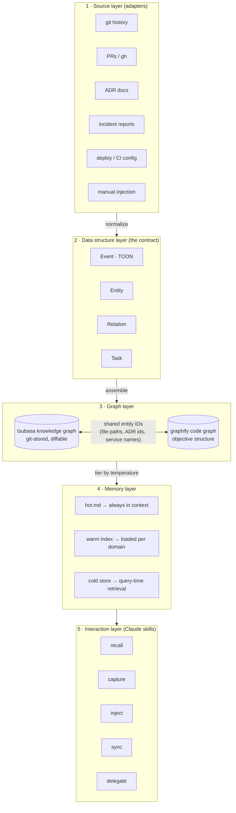
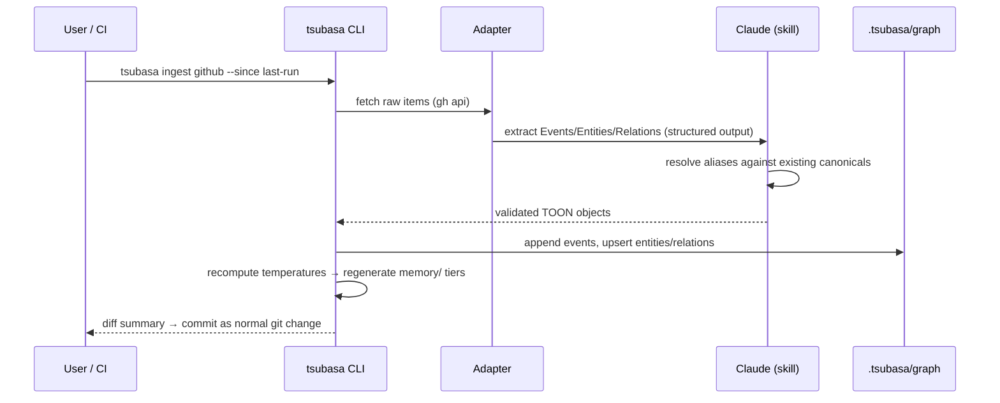
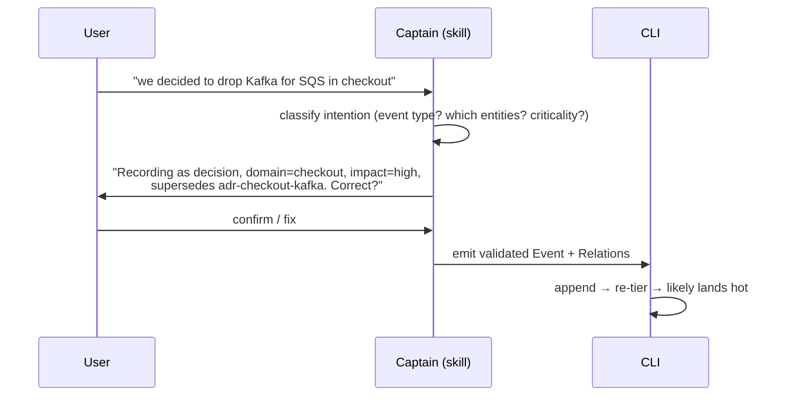
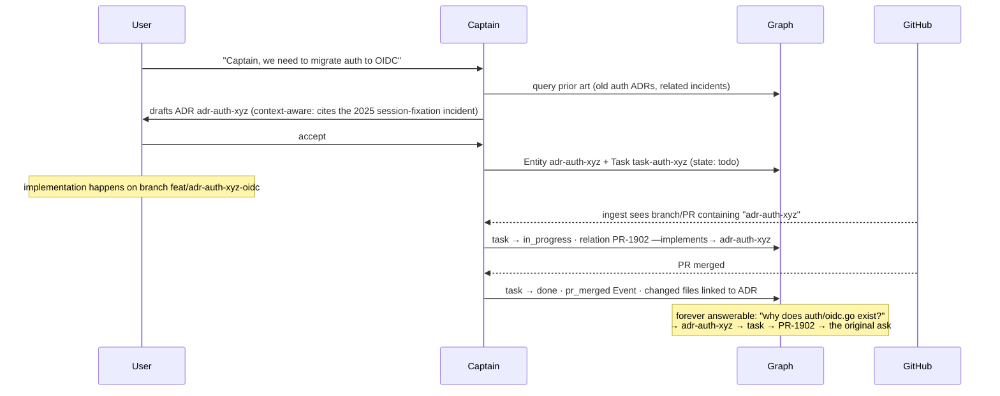

# Tsubasa — Design Document

> *"The ball is your friend."* — Captain Tsubasa
>
> **Tsubasa** is an open-source framework for creating **Captains**: persistent, domain-expert AI personas for a codebase or organization. A Captain is the teammate who's "been at the company for 25 years" — they know why the auth service is shaped the way it is, which incident caused the retry policy, what ADR decided the queue technology, where secrets are deployed, and which task is blocked on which PR.

---

## 1. The problem

LLM coding assistants are brilliant amnesiacs. Every session they can *read* the code, but they don't *know*:

- **Why** — historical decisions, rejected alternatives, tribal knowledge
- **What happened** — incidents, outages, migrations, feature launches
- **What's around the code** — where it's built, deployed, configured; which secrets live where
- **What's in flight** — tasks, their state, and which PR/branch carries them

Code-structure tools (like [Graphify](https://graphify.com/)) solve the *objective* layer: "what calls what, where is X defined." Tsubasa adds the **subjective layer**: event-based organizational knowledge, connected to the objective layer through a shared entity vocabulary — and it all lives **in the repo, in git**, so knowledge travels with the code and is reviewable like code.

## 2. Core concepts

| Concept | Meaning |
|---|---|
| **Captain** | A named, configured instance of tsubasa in a repo (e.g. `captain-tsubasa`). Has a persona (role, e.g. "Engineering Director"), domains, and a knowledge graph. |
| **Event** | The atomic unit of subjective knowledge. Something that *happened*: incident, ADR accepted, PR merged, deploy, config change, manual note. Immutable, timestamped, TOON-encoded. |
| **Entity** | A durable *thing* the Captain knows about: service, module, ADR, incident, feature, task, environment, team, secret-ref, external system. |
| **Relation** | A typed, directed edge between entities: `implements`, `caused_by`, `decided_in`, `deployed_to`, `depends_on`, `supersedes`, `tracked_by`, `references`. |
| **Temperature** | Every piece of knowledge is **hot / warm / cold**, computed from recency × criticality (impact, domain weight) × access. Determines what's always-in-context vs. loaded on demand vs. retrieved by query. |
| **Task** | A first-class entity with state, linked to an ADR ID, tracked to completion via branch/PR naming conventions. |

## 3. Architecture

Five layers. The **data structure layer** is the contract everything else plugs into — sources vary, the shapes never do.



### 3.1 Source layer — adapters

Every adapter answers one question: *"turn this source into Events + Entities + Relations."* Adapters are pluggable; v0.1 ships:

| Adapter | Source | Emits |
|---|---|---|
| `git` | commit history, tags | Events (releases, large refactors), Entities (modules) |
| `github` | PRs, issues via `gh` CLI | Events (pr_merged), Relations (task ↔ PR ↔ files) |
| `adr` | `docs/adr/*.md` (MADR or custom) | Entities (decisions), Events (accepted/superseded), Relations |
| `incident` | markdown postmortems (later: PagerDuty/Opsgenie export) | Events (incidents), Relations (`caused_by`, `mitigated_by`) |
| `deploy` | CI/CD config, IaC, k8s manifests | Entities (environments, secret-refs), Relations (`deployed_to`, `built_by`) |
| `manual` | user injection flow (§5.2) | anything, validated first |

Sources are declared per-Captain in `captain.toml` (`[[sources]]`, managed by `tsubasa source add`); adapters run via CLI (`tsubasa ingest`) or a scheduled CI job.

### 3.2 Data structure layer — the contract

All persisted in **TOON** (token-efficient, LLM-friendly, still human-diffable in git). JSON Schema definitions live in `schema/` so adapters and third-party tools can validate.

**Event** — immutable, append-only:

```toon
event:
  id: evt-2026-07-03-payment-timeout
  type: incident            # incident | adr | pr_merged | deploy | config_change | note | release
  ts: 2026-07-03T14:22:00Z
  title: Payment gateway timeouts during flash sale
  summary: p99 latency spike on payment-svc; root cause connection pool exhaustion.
  criticality:
    impact: high            # high | medium | low
    domains[2]: payments,infra
  actors[2]: team-payments,oncall-rara
  trust: high               # source authority: high | normal | low — feeds reconciliation (§5.6)
  refs[3]:
    - {kind: pr, id: "PR-1841"}
    - {kind: adr, id: adr-payments-pool-sizing}
    - {kind: file, id: "services/payment/pool.go:88"}
  body: |
    <full postmortem / decision text, or pointer to source doc>
```

**Entity** — durable, updatable:

```toon
entity:
  id: svc-payment
  type: service             # service | module | adr | incident | feature | task | env | team | secret-ref | external
  name: payment-svc
  description: Handles all payment gateway integration and retries.
  aliases[2]: payments,payment-service
  profile:                   # enriched by summarization pass (cookbook pattern)
    summary: ...
    key_facts[3]: ...
    time_range: {start: 2023-04, end: ongoing}
  temperature: hot           # computed, cached
  source_events[n]: evt-...,evt-...
```

**Relation** — triple + provenance:

```toon
relation:
  source: adr-payments-pool-sizing
  predicate: decided_because_of
  target: evt-2026-07-03-payment-timeout
  ts: 2026-07-05
  provenance: evt-2026-07-03-payment-timeout
```

**Task** — stateful, ADR-linked:

```toon
task:
  id: task-auth-xyz
  title: Migrate auth to OIDC
  state: in_review           # draft | todo | in_progress | in_review | done | abandoned
  adr: adr-auth-xyz          # the linking key (§5.3)
  branch: feat/adr-auth-xyz-oidc
  prs[1]: "PR-1902"
  domains[1]: auth
  created: 2026-07-10
  updated: 2026-07-14
  history[2]:
    - {ts: 2026-07-10, state: todo, by: user}
    - {ts: 2026-07-14, state: in_review, by: captain, evidence: "PR-1902 opened, branch matches adr-auth-xyz"}
```

**Future knowledge (goals).** The Captain knows where the ship is heading, not just where it's been: `plan` events create `goal` entities (target states, roadmaps, planned procurement). Two special semantics: **open goals never decay out of hot memory** — the future loses relevance by *resolution* (`achieved`/`dropped`), not by age — and **every plan or design discussion must state its alignment or conflict with each relevant open goal** (`works_toward` relations link the work). Commercial amounts in quotations/budgets are excluded by default; the graph records *what* is planned, not what it costs.

**Design rules for the contract:**

1. **Events are facts, Entities are things, Relations are meaning.** Adapters may only *append* Events; Entities/Relations are (re)derived, so a bad ingest is always recoverable.
2. **IDs are the join keys across worlds.** File paths join to graphify's code graph; ADR IDs join tasks ↔ branches ↔ PRs; service names join deploy config ↔ incidents. ID conventions are enforced by schema.
3. **Everything cites provenance.** Every relation and profile fact points back to the Event(s) it came from — same "trace and cite" principle as graphify.

### 3.3 Graph layer

- Stored as **plain TOON/JSONL files in the repo** (`.tsubasa/graph/`) — no database, git is the database. Diffable, reviewable in PRs, mergeable.
- Assembly follows the [Claude cookbook knowledge-graph pipeline](https://platform.claude.com/cookbook/capabilities-knowledge-graph-guide): extract (Haiku) → resolve aliases to canonicals (Sonnet) → summarize hub entities → serialize subgraphs as triples for querying. Incremental: new events resolve against existing canonical entities, only new edges are added.
- **The code layer is a snapshot graph, not events.** Code-derived knowledge (services, dependencies, deploy targets, secret-refs) is re-derived wholesale from the code on every ingest and stamped `code@<repo>:<sha>` — never appended, so it can never be staler than the last ingest. The `code` adapter extracts deterministic structure (compose/k8s/build manifests); deeper symbol-level structure can come from [graphify](https://graphify.com/) as a link, not a merge. Queries merge both layers: events carry the why, the snapshot carries the what-is.
- **Trust hierarchy** (encoded, not implied): `code snapshot > ADR / user injection > other docs`. Docs outside `adr/`/`decisions/` ingest at `trust: low` and are labeled `doc-derived, verify in code` in query results — docs rot; code doesn't lie.

#### Why native graph + graphify, not one graph

Code truth and org truth have different physics; one store fails both:

| | code truth (graphify) | org truth (native graph) |
|---|---|---|
| source | the AST, deterministic | events: decisions, incidents, statements |
| rebuild | free, any time (`tsubasa index`) | impossible — history exists only as recorded events |
| staleness model | never staler than last index | never stale: append-only, superseded not deleted |
| storage | snapshot, replaced wholesale | event log, entities replayed from it |

Code facts distilled into events rot silently as code moves; org facts kept in a rebuilt snapshot are lost on every rebuild. So each layer keeps its native physics, and **anchors** (committed `(entity, repo, node)` rows, matched by node *name* so index rebuilds don't break them) join the two by ID.

#### Connecting code semantics: graphify deep mode vs AST index + LLM link

| | `/graphify --mode deep` (LLM reads code) | `tsubasa index` + `link --llm` (default) |
|---|---|---|
| LLM reads | source chunks of every file | entity descriptions + top code-node names only |
| cost scaling | with codebase size | with entity count; ~1 call per repo |
| determinism | semantic edges vary run to run | index fully deterministic; only anchors are proposed |
| refresh | full deep pass per change | re-index free at ingest; name-based anchors survive |
| yield | rich intra-code semantic edges | org ↔ code joins, which captain queries actually need |
| role | explicit per-repo choice when deep code semantics warrant it | default for every fleet repo |

The captain's queries need the *join* (which code embodies this decision), not intra-code semantics; deep mode stays an explicit opt-in.

### 3.4 Memory layer — cold / warm / hot

Temperature is a **score, recomputed on ingest and on a periodic decay pass**:

```
temp(k) = w_r · recency(k) + w_i · impact(k) + w_d · domain_weight(k) + w_a · access_freq(k)
```

- weights (`w_*`) and domain weights are per-Captain config (`captain.toml`) — an "Engineering Director" Captain weights incidents and ADRs high; a "Staff IC" Captain might weight code-adjacent events higher.
- **Re-heating:** when a new event references old knowledge (new incident cites an old ADR), the referenced knowledge's temperature rises. Knowledge cools by time, never by deletion.

| Tier | What | Where it lives | When Claude sees it |
|---|---|---|---|
| **Hot** | active tasks, recent/critical incidents, load-bearing ADRs | `memory/hot.md`, generated; referenced from CLAUDE.md | Always — injected at session start |
| **Warm** | Per-domain summaries + entity index (one line per entity) | `memory/index.md`, `memory/domains/*.md` | Loaded when the conversation touches that domain |
| **Cold** | Full events, full bodies, superseded decisions | `graph/events/**` | Retrieved by graph query only |

**Hot budget is dynamic, not fixed.** `captain.toml` sets only a ceiling as a % of the model's context window (default: `hot_max_context: 25%`). Within that ceiling, what actually gets included is decided by temperature score at generation time — no per-category quotas. If an active incident plus five tasks compete, the score decides; if the ceiling is hit, the lowest-scored items demote to warm with a pointer line so nothing silently disappears.

This mirrors how the 25-year veteran actually works: a few things top-of-mind, a mental index of "I know we have something about that," and the ability to go dig up the details.

### 3.5 Interaction layer — the Captain as right-hand man

A Captain ships as a **Claude Code plugin** (skills + hooks), but the primary UX is **ambient, not command-driven**: the user talks to Claude as normal; the Captain persona extends every answer with its knowledge and **automatically captures decision moments** into memory + repo.

**Ambient capture** — the skill instructs Claude to detect and persist at these moments:

| Moment | Trigger | What's saved (after a one-line confirmation) |
|---|---|---|
| Decision accepted | user approves a proposed design/flow | ADR entity + task (todo) + discussion-summary Event |
| Fact stated | user asserts knowledge ("we dropped Kafka for SQS") | Event, connected to existing entities; conflict-probe if it supersedes something |
| Incident mentioned | user describes an outage/failure | incident Event + relations |
| Work completed | PR/branch with ADR ID observed at ingest | task state transition with evidence |

The confirmation line is the **validation gate**: it restates intent and shows which existing entities it will connect to, so the graph stays trustworthy without ceremony.

**No slash commands in normal use.** The user types plain language; routing is done by the model itself, guided by skill descriptions (model-invoked skills) — the `SessionStart` hook injects the persona + hot tier, so the session simply *is* the Captain. Skills call the tsubasa CLI (via Bash) for deterministic ops:

```
user types plain english
  │
  ▼  session = captain (persona + hot.md injected at start)
  ├─ asks about the system      → [skill: recall]  → tsubasa query
  ├─ discusses, then accepts    → [skill: capture] → tsubasa adr/task write
  ├─ states a fact / incident   → [skill: inject]  → gate → tsubasa event append
  ├─ mentions done work         → [skill: sync]    → tsubasa ingest --incremental
  └─ ordinary coding request    → plain claude, knowledge-flavored
```

The `tsubasa` CLI remains the explicit override for scripting, CI, and debugging.

**Hooks:** `SessionStart` loads the hot tier; a post-commit/PR hook (or CI job) triggers incremental ingest so task states stay current without anyone asking.

### 3.6 Captain as team lead — orchestration

The Captain **plans and validates; subagents implement**. It never writes feature code itself — it briefs a Claude subagent (or team of agents), monitors them, unblocks them, and validates their output against the knowledge graph before accepting it. Escalation goes one level at a time:

```
        USER  (owner — final authority)
          ▲
          │ escalates: implementation approval, permission grants,
          │            decisions the graph can't answer
        CAPTAIN  (team lead — plan · brief · monitor · validate · capture)
          ▲
          │ escalates: idle too long, stuck on permission,
          │            repeated failure, scope conflict with an ADR
        SUBAGENTS / AGENT TEAMS  (implementers)
```

The delegation loop:

```
plan approved (ADR + task exist)
  │
  ▼ captain decomposes → briefs, each brief carries:
  │    scoped goal · relevant warm-knowledge slice · constraints
  │    from ADRs ("sync writes only — see adr-gw-session-double-write")
  ▼
  spawn subagent(s) ──▶ monitor
  │        ├─ progressing        → let it run
  │        ├─ idle / stuck-perm  → captain unblocks if it can,
  │        │                       else escalates to USER
  │        └─ output ready       → captain validates vs. graph:
  │              ├─ violates an ADR/constraint → send back with citation
  │              └─ pass → accept · task advances · Event captured
  ▼
  user only sees: the plan, escalations, and the validated result
```

Because briefs are generated from the graph, subagents inherit the Captain's knowledge without loading all of it — each gets only the slice its task needs.

### 3.7 Captain response contract

The Captain's voice is part of the spec. `tsubasa init` writes the full principle set into the workspace `CLAUDE.md` (response rules, an enforced ADR format, and communication rules following Strunk & White's *The Elements of Style*) — plain markdown the user edits to fit their org, loaded every session alongside the hot tier. The `SessionStart` hook reinforces the same contract. The core rules:

1. **Straightforward answers only.** No hedging, no option surveys unless asked.
2. **Proactively flag only what's critical** — security, performance, or risk. Everything else waits to be asked.
3. **Respect reading time.** Short, simple, straight to the point.
4. **Prefer ASCII flows and comparison tables** over prose — the user should *see* what it means.
5. **Every claim cites** (event ID, ADR, PR, file:line) or the Captain says it doesn't know.
6. **Push back for consistency.** When a request conflicts with recorded ADRs or decisions, the Captain cites the conflict; the record changes first, then it follows.

## 4. Repository layouts

### 4.1 The framework repo (`ramarahmanda/tsubasa`)

```
tsubasa/
├── README.md
├── DESIGN.md                    # this document
├── schema/                      # JSON Schema for event/entity/relation/task
├── src/tsubasa/                 # Python CLI (uv), deterministic core
│   ├── cli.py                   # init · ingest · query · task · study · doctor
│   ├── adapters/                # git · github · adr · incident · code · docs
│   ├── graph/                   # assembly, reconciliation, query, graphify bridge
│   └── memory/                  # temperature scoring, tier generation
├── plugin/                      # Claude Code plugin
│   ├── skills/                  # onboard · recall · capture · inject · sync · delegate
│   └── hooks/                   # SessionStart: persona + hot tier
└── tests/
```

**CLI (Python) does the deterministic work** — parsing, schema validation, graph file ops, temperature math, decay. **Skills do the judgment work** — extraction, entity resolution, intention validation, answering. This split keeps token costs down and makes the graph reproducible.

### 4.2 A user's repo after `tsubasa init tsubasa`

```
their-project/
├── .tsubasa/
│   ├── captain.toml             # persona, domains, sources, temperature weights
│   ├── graph/
│   │   ├── entities.toon
│   │   ├── relations.toon
│   │   └── events/2026/07/evt-*.toon
│   ├── tasks/task-*.toon
│   └── memory/                  # generated — hot.md, index.md, domains/*.md
├── CLAUDE.md                    # persona principles + @.tsubasa/memory/hot.md
└── ... their code ...
```

Only knowledge lives in the repo — no binaries, no DB, no secrets (secret-*refs* name where a secret lives, never its value; `tsubasa doctor` lints for accidental secret values before commit).

## 5. Flows

### 5.1 Ingestion



### 5.2 Manual injection — user input is validated, never trusted raw



The validation step is what keeps the graph trustworthy: the Captain restates *what it understood* (type, entities touched, criticality, what it supersedes) before anything is written.

### 5.3 Task lifecycle — ADR ID as the thread

Task creation is **ambient** (§3.5): the user discusses a change with the Captain as a normal conversation; on acceptance the Captain drafts the ADR, creates the task, and commits — no command needed. From there the convention takes over: **the ADR ID appears in the branch name and/or PR title**, and that's all the tracking machinery needs.



State transitions made by the Captain always carry `evidence` (which PR, which event) in the task history — auditable, like everything else.

### 5.4 Query

1. Identify entities in the question (aliases resolved).
2. Pull hot + relevant warm context; serialize the N-hop subgraph around matched entities as triples.
3. If the question is structural ("what calls / depends on"), bridge to graphify.
4. Answer **with citations**: event IDs, ADR IDs, PR numbers, file:line. A Captain that can't cite says "I don't have knowledge about that" — no confabulated history.

### 5.5 Reconciliation — self-correcting knowledge (v0.1, runs on every write)

Every new Event — from any adapter or ambient capture — passes a contradiction check before the graph is updated. This is what lets the Captain correct itself instead of accumulating stale truths:

```
new Event arrives (any source)
  │
  ▼ contradiction check vs. existing entities/relations
  ├─ no conflict ──▶ append, done
  └─ conflicts with X
        │
        ▼ verify: recency? trust level? corroborating events?
        ├─ new wins  ──▶ supersede X (old kept, cooled, marked)
        ├─ old wins  ──▶ append as disputed, low trust
        └─ unclear   ──▶ queue a question for the user (asked at
                          the next natural moment, not as spam)
```

Superseded knowledge is never deleted — it cools and stays traversable ("we used Kafka until 2026-07 because…").

### 5.6 Decay & compaction (scheduled)

A periodic pass (CI cron or `tsubasa ingest`):
recompute temperatures → demote cooled knowledge out of hot/warm → merge duplicate entities → roll old low-impact events into period summaries (originals stay in cold) → regenerate `memory/`. Keeps `hot.md` within its token budget permanently.

## 6. Installation & distribution

| Method | For | How |
|---|---|---|
| Claude Code plugin | most users | `claude plugin marketplace add ramarahmanda/tsubasa` → `claude plugin install tsubasa@tsubasa` |
| CLI | CI, scripting, non-Claude use | `uv tool install tsubasa` |
| git clone | contributors, vendoring | clone + `plugin/` symlink |

The knowledge format is the stable public interface — any agent that can read TOON files in `.tsubasa/` can be a Captain client, keeping the project useful beyond one assistant.

## 7. Roadmap

- **v0.1 — the contract + walking skeleton:** schemas (incl. `trust`); `init`/`ingest`(adr, manual)/`query`; **reconciliation pass (§5.5)** — self-correction is core, not a later add-on; hot/warm/cold generation; Captain recall + capture + inject skills; example captain-tsubasa.
- **v0.2 — real-world task thread:** `forgejo`/gitea adapter (PR sync where GitHub isn't the host), scheduled ingest (CI cron / forgejo actions template), headless batch study (`claude -p`) for deep history distillation, access tracking (the `w_access` temperature signal).
- **v0.3 — the veteran:** entity resolution + hub summarization LLM passes (cookbook stages 2-3), decay/compaction job (event rollups), temporal queries ("what did we believe in March?"), graphify bridge for symbol-level structure.
- **v0.4 — ecosystem:** visibility tiers on events (sensitive knowledge), per-actor authority model, Captain Core extraction (Agent SDK) for chatbot shells, push adapters (WhatsApp/Slack streams), adapter plugin API, eval harness (gold Q&A per captain).

## 8. Open questions

1. **TOON everywhere vs. TOON-for-context + JSONL-at-rest** — TOON is great in prompts; whether it's also the best at-rest format (merge conflicts, tooling) should be validated in v0.1.
2. **Monorepo-scale graphs** — at what event count do we need sharding by domain (`graph/domains/payments/…`)?
3. **Multi-repo Captains** — an Engineering Director spans repos; likely a dedicated "captain repo" that references others (post-v0.4).
4. **Privacy tiers** — incident data can be sensitive; a `visibility` field on Events may be needed before orgs adopt it.
